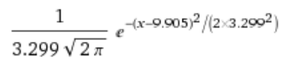
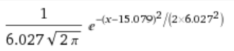
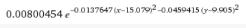
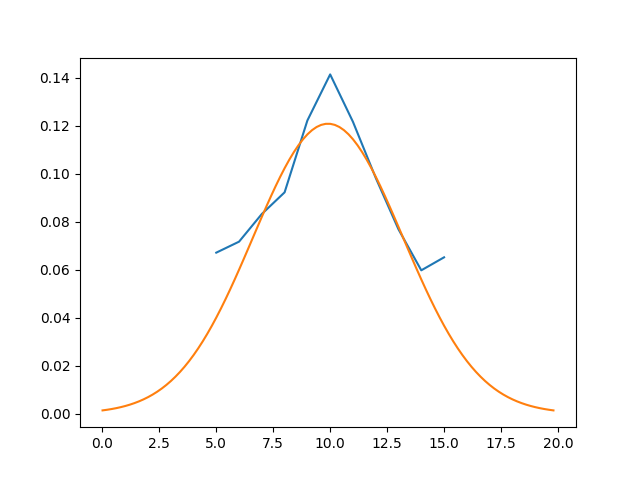
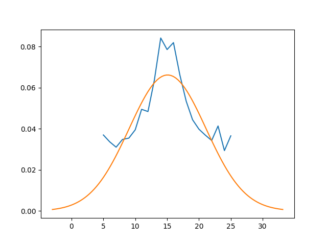
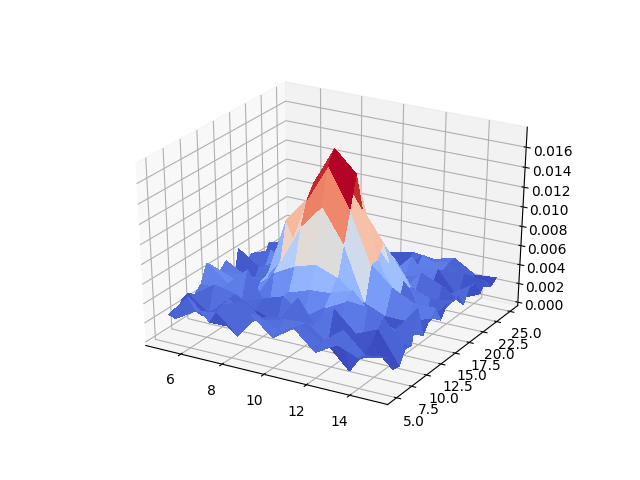

# Trabajo Escrito
* Punto 1:
Se aproximo ambas pmf's con una distribucion gaussiana. Usando la funcion curve_fit, se encontro que la curva de mejor ajuste para la variable X es una
distribucion Gaussiana con desviacion estandar de 3,299 y promedio de 9,9048.
La expresion analitica de la pmfX entonces seria:

La curva de mejor ajuste para la variable Y es una distribucion Gaussiana con desviacion estandar de 6,026 y promedio de 15,079.
La expresion analitica de la pmfX entonces seria:

* Punto 2:
Si asumimos que X y Y son independientes, entonces la pmfXY es el producto de la pmfX y la pmfY:
pmfXY= pmfX * pmfY
La expresion analitice de la pmfY entonces seria:

* Punto 3:

Usando la formula de correlacion, se encontro que este tiene un valor de 149,5428 entre la variable X y Y. Este valor indica que tan linealmente relacionados estan
las variables X y Y.

Para encontrar la covarianza, primero se encontro el promedio de X y el promedio de Y. Luego con estos resultados se encontro que la covarianza es 0,0677. Este valor indica
que tan independiente son las variables X y Y. Si X es independiente de Y se esperaria un valor cercano a 0. Como se observa, el valor obtenido es casi 0 lo que indica que
nuestra asuncion inicial fue correcta.

Para encontrar el coeficiente de correlacion primero se encontro la desviacion estandar de X y Y. Luego se utilizo la formula y se encontro que el coeficiente es 0,003536.

* Punto 4:
La pmfX:

La pmfY:

La pmfXY:

